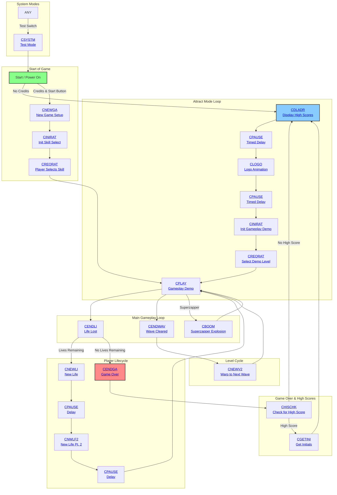

# Tempest: Game State Flow

This document provides a complete, reconstruction-grade specification of the entire game state machine for Tempest. It details every state, the logic contained within each, and the precise conditions and actions that cause transitions between them.

## 1. Core State Machine Mechanism

The game's flow is controlled by two parallel state machines, one for game logic and one for display logic.

*   **Game Logic State:** The primary state is stored in the `QSTATE` variable. Its value is an index into the `ROUTAD` jump table located in `source/ALEXEC.MAC`. At the start of each frame, the main loop executes the subroutine pointed to by the current `QSTATE` index.
*   **Display Logic State:** A secondary state is stored in the `QDSTATE` variable. Its value is an index into the `DROUTAD` jump table in `source/ALDIS2.MAC`. This determines which high-level display function is called to build the [Vector Graphics Engine's](SYSTEMS.md#1-vector-graphics-engine) display list for that frame.

Transitions are managed by directly changing the value of `QSTATE` or `QDSTATE`. Timed transitions are handled by the generic [`CPAUSE`](#48-state-cpause-generic-pause) state, which waits for a specified number of frames before setting `QSTATE` to a pre-configured "next state" (`QNXTSTA`).

## 2. Complete List of Game States

The following table lists every game state constant defined in `source/ALCOMN.MAC`.

| Constant | Value (Hex) | Description |
|---|---|---|
| [`CNEWGA`](#41-state-cnewga-new-game) | 00 | **New Game:** Initializes a new game for 1 or 2 players. |
| [`CNEWLI`](#45-state-cendli-cnewli--cnwlf2-player-death--respawn) | 02 | **New Life:** Initializes a new life after a player dies. |
| [`CPLAY`](#43-state-cplay-gameplay) | 04 | **Play:** The main state for active gameplay. |
| [`CENDLI`](#45-state-cendli-cnewli--cnwlf2-player-death--respawn) | 06 | **End Life:** Processes the events after a player life is lost. |
| [`CENDGA`](#46-state-cendga-chischk--cgetini-game-over--high-scores) | 08 | **End Game:** Processes the end of a game and transitions to high scores. |
| [`CPAUSE`](#48-state-cpause-generic-pause) | 0A | **Pause:** A generic timed pause state used between other states. |
| `CNEWAV` | 0C | **New Wave:** Initializes enemies for a new wave/level. |
| [`CENDWAV`](#44-state-cendwav--cnewv2-end-of-wave-and-warp) | 0E | **End Wave:** Processes the end of a wave and calculates bonuses. |
| [`CHISCHK`](#46-state-cendga-chischk--cgetini-game-over--high-scores)| 10 | **High Score Check:** Checks if the player's score qualifies for the table. |
| [`CGETINI`](#46-state-cendga-chischk--cgetini-game-over--high-scores)| 12 | **Get Initials:** The state for entering initials into the high score table. |
| [`CDLADR`](../ATTRACT_MODE.md#21-high-score-display-cdladr) | 14 | **Display Ladder:** Displays the high score table (part of the attract mode). |
| [`CREQRAT`](#42-state-cinirat--creqrat-skill-selection)| 16 | **Request Rate:** The "Rate Yourself" skill level selection screen. |
| [`CNEWV2`](#44-state-cendwav--cnewv2-end-of-wave-and-warp) | 18 | **New Wave 2:** The second part of the new wave sequence (the "warp" effect). |
| [`CLOGO`](../ATTRACT_MODE.md#22-logo-presentation-clogo) | 1A | **Logo Init:** Initializes the Atari logo animation in the attract mode. |
| [`CINIRAT`](#42-state-cinirat--creqrat-skill-selection)| 1C | **Initialize Rate:** Initializes the gameplay demo or the skill selection screen. |
| [`CNWLF2`](#45-state-cendli-cnewli--cnwlf2-player-death--respawn) | 1E | **New Life 2:** The second part of the new life sequence. |
| `CDROP` | 20 | **Drop Mode:** A special gameplay mode for specific enemies. |
| [`CSYSTM`](#49-state-csystm-system-test-mode) | 22 | **System:** The operator-facing system test and diagnostic mode. |
| [`CBOOM`](#47-state-cboom-superzapper) | 24 | **Boom:** The state that handles the Superzapper explosion effect. |

## 3. Game State Flow Diagram

The following diagram illustrates the complete, high-level flow between all major game states.

---

## 4. State Reference: Detailed Breakdown

This section provides a detailed, reconstruction-grade breakdown of each individual game state.

### 4.1. State: `CNEWGA` (New Game)

*   **Routine:** `NEWGAM` in `source/ALEXEC.MAC`
*   **Purpose:** To perform the initial setup for a new 1- or 2-player game, clearing old game data and initializing player-specific variables like lives and starting wave.

#### Actions and Activities
The state's primary activity is variable initialization.
*   **Initialization:** Calls `INICHK` to initialize language pointers and game options, and `INIDSP` to prepare the display system.
*   **Score Clearing:** If not in [Attract Mode](../ATTRACT_MODE.md#attract-mode), it calls `CLRSCO` to zero out the scores for both players.
*   **Player Setup Loop:** It loops once for each active player (`NUMPLA`) and performs the following:
    *   Sets the initial number of lives for the player (`LIVES1` or `LIVES2`) based on the `LVSGAM` (Lives per Game) option setting.
    *   Sets the starting wave number (`WAVEN1` or `WAVEN2`) to -1. This special value forces the game to transition to the "Rate Yourself" (skill select) screen for the first wave.
*   **Starfield Control:** Deactivates the starfield effect by clearing the `PLAGRO` flag.

#### Timing and Duration
This state is **transient**. It performs its setup actions and immediately transitions to another state within the same frame. It has no duration.

#### Entry and Exit Conditions
*   **Entry:** This state is entered only when the `PROCRE` routine detects that a player with sufficient credits has pressed the 1- or 2-player START button.
*   **Exit:** The state **always** exits by jumping to the `INIRA0` routine (in `ALWELG.MAC`), which is the entry point for the "Rate Yourself" / Skill Select logic ([`CREQRAT`](#42-state-cinirat--creqrat-skill-selection) state). There are no other exit paths.

#### State Variables and Flags
| Variable | Action | Description |
|---|---|---|
| `LIVES1`, `LIVES2` | Write | Set to the starting number of lives (`LVSGAM`). |
| `WAVEN1`, `WAVEN2` | Write | Set to -1 to force skill selection. |
| `LSCORH/M/L` | Write | Cleared to 0 by `CLRSCO`. |
| `RSCORH/M/L`| Write | Cleared to 0 by `CLRSCO`. |
| `PLAYUP` | Write | Set to the current player being initialized. |
| `NEWPLA` | Write | Set to 0, to ensure Player 1 starts the game. |
| `PLAGRO` | Write | Set to 0 to deactivate the starfield. |

#### Input Handling
*   All player inputs (rotary knob, fire, [Superzapper](ENTITIES.md#entity-superzapper-weapon)) are **ignored** during this state.

#### Sound and Audio Behavior
*   No sounds are played during this state.

#### Visual and Rendering Behavior
*   No rendering occurs during this state. It transitions out before a display list is generated. The screen remains blank or shows the last frame from the previous state (typically the [Attract Mode](../ATTRACT_MODE.md#attract-mode)).

### 4.2. State: `CINIRAT` / `CREQRAT` (Skill Selection)

These two states are tightly coupled and manage the "Rate Yourself" skill selection screen that appears before a new game or a new player's turn in a 2-player game.

*   **Routines:** `INIRA0`, `INIRAT`, `PRORAT` in `source/ALWELG.MAC`
*   **Purpose:** To allow the player to choose their starting difficulty level (and thus, starting score bonus) by moving a cursor between two columns of level numbers. It is also used by the [Attract Mode](../ATTRACT_MODE.md#attract-mode) to select a random level for the gameplay demo.

#### Actions and Activities
*   **Initialization (`INIRAT`):**
    *   Sets the current player (`PLAYUP`). For a 2-player game, it calls `SWAPEN` to store the first player's enemy data.
    *   Initializes the left and right side level choices (`LEFSID`, `RITSID`).
    *   Resets the player cursor position (`CURSL1`, `CURSPO`).
    *   **Attract Mode:** If in [Attract Mode](../ATTRACT_MODE.md#attract-mode) (`QSTATUS` bit `MATRACT` is set), it sets a timer (`TIMHIS`) for 1 second (20 frames) before auto-selecting a level. It also sets the display state to `CDREQRA`.
*   **Interaction (`PRORAT`):**
    *   **Player Control:** Calls `GETCUR` to read the rotary knob input and update the player's cursor position (`CURSL1`) on the screen.
    *   **Timer:** Decrements a 10-second master timer (`QTMPAUS`). If it reaches zero, the selection is made automatically. At the 3-second mark, a warning sound (`S3SWAR`) is played.
    *   **Selection:** When the player presses FIRE or SUPERZAPPER (`MFIRE` or `MSUZA` bits in `SWFINA`), or the timer runs out, the state records the selected level.
    *   **Attract Mode Auto-Selection:** If in [Attract Mode](../ATTRACT_MODE.md#attract-mode), the logic uses the `RANDOM` value to pick a level from the first 8 available levels.

#### Timing and Duration
*   **[`CINIRAT`](#42-state-cinirat--creqrat-skill-selection):** This state is transient and immediately transitions to [`CREQRAT`](#42-state-cinirat--creqrat-skill-selection).
*   **[`CREQRAT`](#42-state-cinirat--creqrat-skill-selection):** This state has a maximum duration of **10 seconds**. It can end sooner if the player makes a selection. A warning sound plays for the last 3 seconds.

#### Entry and Exit Conditions
*   **Entry:** The game enters [`CINIRAT`](#42-state-cinirat--creqrat-skill-selection) from [`CNEWGA`](#41-state-cnewga-new-game) (at the start of a game) or from [`CENDLI`](#45-state-cendli-cnewli--cnwlf2-player-death--respawn) (at the start of the next player's turn in a 2-player game).
*   **Exit:** The state exits when a level is selected (either by player input or timer). It **always transitions to the [`CPLAY`](#43-state-cplay-gameplay) state** after performing final setup.
    *   It sets `CURWAV` to the chosen level.
    *   It calls `INICOL`, `CONTOUR`, `INIENE`, and `INISUZ` to build the level and prepare all game objects for play.

#### State Variables and Flags
| Variable | Action | Description |
|---|---|---|
| `QSTATE` | Write | Set to [`CREQRAT`](#42-state-cinirat--creqrat-skill-selection) by `INIRAT`. Set to [`CPLAY`](#43-state-cplay-gameplay) upon exit from `PRORAT`.|
| `QDSTATE` | Write | Set to `CDREQRA` to show the skill selection UI. |
| `QTMPAUS` | Write/Read | Initialized to 10 (seconds), decremented each second. |
| `TIMHIS` | Write/Read | A 1-second timer used to drive the `QTMPAUS` countdown. |
| `CURSL1` | Write/Read | The player's cursor position (the selected level index). |
| `SWFINA` | Read | Checks for `MFIRE` or `MSUZA` bits to detect player selection. |
| `WAVEN1/2` | Write | The selected starting wave number is stored here for the current player.|
| `RANDOM` | Read | Used in [Attract Mode](../ATTRACT_MODE.md#attract-mode) to pick a random starting level. |

#### Input Handling
*   **Rotary Knob:** Actively read by `GETCUR` to move the cursor.
*   **Fire Button:** Accepted as a "select" action.
*   **Superzapper Button:** Also accepted as a "select" action.
*   **Start Buttons:** Accepted as a "select" action only if the timer is below 8 seconds.

#### Sound and Audio Behavior
*   **3-Second Warning:** When `QTMPAUS` reaches 3, the `S3SWAR` ("3-second warning") sound is played. This is defined in [DATA_ASSETS.md#sound-data](DATA_ASSETS.md#sound-data).
*   No other sounds or music are active during this state.

#### Visual and Rendering Behavior
*   The `CDREQRA` display state is active. This is handled by the `RQRDSP` routine in `ALDIS2.MAC`.
*   It renders the "RATE YOURSELF" text and the two columns of selectable starting levels, using text from [DATA_ASSETS.md#text-and-language-data](DATA_ASSETS.md#text-and-language-data).
*   The player's cursor (a flashing indicator) is drawn next to the currently highlighted level number.

### 4.3. State: `CPLAY` (Gameplay)

This is the central state where all interactive gameplay occurs.

*   **Routine:** `PLAY` and its subroutines in `source/ALWELG.MAC`
*   **Purpose:** To manage the entire active gameplay loop, including player control, enemy behavior, object updates, collision detection, and scoring.

#### Actions and Activities
The `PLAY` routine is the master "tick" function for the game. It executes once per frame and calls a sequence of subroutines to update the entire game world.

*   **Execution Order:**
    1.  `GETCUR`: Reads the rotary knob input.
    2.  `MOVCUR`: Updates the player's [ship](ENTITIES.md#entity-player-ship-blaster--cursor) position (`CURSPO`).
    3.  `SLAUNC`: Checks for the `MFIRE` flag and launches a [player projectile](ENTITIES.md#entity-player-bullet-player-charge) if pressed.
    4.  `MOVCHA`: Updates the position of all active player projectiles.
    5.  `MOVSPK`: Updates the logic and position for [Spikers](ENTITIES.md#entity-spiker--spike).
    6.  `MOVINV`: Updates the logic and position for [Tankers](ENTITIES.md#entity-tanker) and [Flippers](ENTITIES.md#entity-flipper).
    7.  `MOVNYM`: Updates the logic and position for Nymphs and [Fuseballs](ENTITIES.md#entity-fuseball).
    8.  `MOVEXP`: Updates the animation frames for all active explosions.
    9.  `COLLID`: Performs all collision detection between game objects.
    10. `INTANK`, `INFLIP`, etc: Spawns new enemies based on level-specific timers and rules.
    11. `PRSTAR`: Updates the starfield animation.
*   **Superzapper:** Checks for the `MSUZA` flag. If pressed, it transitions to the [`CBOOM`](#47-state-cboom-superzapper) state.

#### Timing and Duration
*   This state is **indefinite**. It persists as long as the player is alive and enemies remain on the screen.
*   Its duration is entirely dependent on player skill and the current level's difficulty.

#### Entry and Exit Conditions
*   **Entry:**
    *   From [`CREQRAT`](#42-state-cinirat--creqrat-skill-selection) after the player selects their starting skill level.
    *   From [`CNEWV2`](#44-state-cendwav--cnewv2-end-of-wave-and-warp) after the "warp" animation to the next wave is complete.
    *   From [`CNWLF2`](#45-state-cendli-cnewli--cnwlf2-player-death--respawn) after the brief pause for a new life begins.
    -   From [`CBOOM`](#47-state-cboom-superzapper) after the Superzapper explosion animation finishes.
*   **Exit:**
    *   **Player Death:** If a collision results in player death, the state transitions to [`CENDLI`](#45-state-cendli-cnewli--cnwlf2-player-death--respawn) (End Life).
    *   **Wave Cleared:** If the total number of active invaders (`INMCOU`) is zero, the state transitions to [`CENDWAV`](#44-state-cendwav--cnewv2-end-of-wave-and-warp) (End Wave).

#### State Variables and Flags
This state reads from and writes to nearly all gameplay variables. Key variables include:
| Variable | Action | Description |
|---|---|---|
| `CURSPO` | R/W | The player's current position on the well rim. |
| `SWFINA` | R/W | Read for input flags (`MFIRE`, `MSUZA`); cleared after processing. |
| `LIVES1/2`| Read | Checked to see if the player is alive. Decremented on death. |
| `INMCOU` | Read | The total count of active invaders. Used to check for wave clear. |
| `INVAY`, `CHARY`, etc. | R/W | The state tables for all dynamic game objects (enemies, projectiles). |
| `QSTATE` | Write | Set to [`CENDLI`](#45-state-cendli-cnewli--cnwlf2-player-death--respawn) or [`CENDWAV`](#44-state-cendwav--cnewv2-end-of-wave-and-warp) on exit. |

#### Input Handling
*   **Rotary Knob:** Actively read each frame to control player movement.
*   **Fire Button:** Actively read each frame to trigger projectile launch.
*   **Superzapper Button:** Actively read each frame to trigger the [Superzapper](ENTITIES.md#entity-superzapper-weapon).
*   **Start Buttons:** Ignored.

#### Sound and Audio Behavior
*   The main gameplay "heartbeat" music is active, with the tempo determined by the current level.
*   All gameplay sound effects are active and triggered by events, as defined in [DATA_ASSETS.md#sound-data](DATA_ASSETS.md#sound-data):
    *   `SLAUNC`: Player fire sound.
    *   `SBOING`: Enemy explosion sound.
    *   `ESLSON`, `EXSNON`: Enemy-specific sounds.
    *   The [Sound Engine](SYSTEMS.md#8-sound-engine-alsounmac) is continuously updated based on game events.

#### Visual and Rendering Behavior
*   The `CDPLAY` display state is active.
*   All game objects are rendered: the [player ship](ENTITIES.md#entity-player-ship-blaster--cursor), [enemies](ENTITIES.md#entity-flipper), [projectiles](ENTITIES.md#entity-player-bullet-player-charge), and explosions.
*   The "well" and the starfield are rendered.
*   The score, lives, and other HUD elements are displayed via the `INFO` routine.
*   This is the most visually complex state in the game.

### 4.4. State: `CENDWAV` & `CNEWV2` (End of Wave and Warp)

This is a two-state sequence that handles the transition between levels after the player successfully clears a wave.

*   **Routines:** `ENDWAV` in `source/ALEXEC.MAC`, `NEWAV2` in `source/ALWELG.MAC`
*   **Purpose:** To calculate and award the end-of-wave bonus, increment the player's level, and perform the "warp" animation of the player flying down the tube to the next level.

#### Actions and Activities
1.  **[`CENDWAV`](#44-state-cendwav--cnewv2-end-of-wave-and-warp) (End Wave):**
    *   Increments the current player's wave number (`WAVEN1` or `WAVEN2`), unless it has reached the maximum of 99.
    *   Increments the `CURWAV` variable.
    *   Checks if the player earned a bonus (`BONUS` flag). If so, it calls `BONSCO` to look up the bonus value from a table and `UPSCOR` to add it to the player's score.
    *   Plays a bonus sound (`SAUSON`).
    *   Transitions immediately to the [`CNEWV2`](#44-state-cendwav--cnewv2-end-of-wave-and-warp) state.

2.  **[`CNEWV2`](#44-state-cendwav--cnewv2-end-of-wave-and-warp) (New Wave 2 / "Warp"):**
    *   This state handles the procedural animation of "flying" to the next level.
    *   It calculates a new, closer Z-coordinate for the camera (`EYL`, `EYH`) relative to the end of the well (`ZADEST`, `ZADJL`).
    *   In a loop that runs for multiple frames, it progressively moves the camera's Z position closer to the destination, creating the warp effect.
    *   The `ROFDIS` flag is set to `0xFF` to force the `DSPWEL` routine to redraw the well each frame of the animation.

#### Timing and Duration
*   **[`CENDWAV`](#44-state-cendwav--cnewv2-end-of-wave-and-warp):** This state is **transient**, executing its logic and transitioning to [`CNEWV2`](#44-state-cendwav--cnewv2-end-of-wave-and-warp) within a single frame.
*   **[`CNEWV2`](#44-state-cendwav--cnewv2-end-of-wave-and-warp):** This state is **time-limited**. Its duration is determined by the distance the "eye" has to travel and the speed of the warp. The animation continues until the eye's Z-position (`EYL`, `EYH`) matches the destination Z-position (`EYLDES`). This typically lasts for about 1-2 seconds.

#### Entry and Exit Conditions
*   **Entry:** [`CENDWAV`](#44-state-cendwav--cnewv2-end-of-wave-and-warp) is entered from [`CPLAY`](#43-state-cplay-gameplay) when the `INMCOU` (invader count) variable reaches zero.
*   **Exit:**
    *   [`CENDWAV`](#44-state-cendwav--cnewv2-end-of-wave-and-warp) always transitions to [`CNEWV2`](#44-state-cendwav--cnewv2-end-of-wave-and-warp).
    *   [`CNEWV2`](#44-state-cendwav--cnewv2-end-of-wave-and-warp) exits when the warp animation is complete. It **always transitions back to the [`CPLAY`](#43-state-cplay-gameplay) state** to begin the next level.
    *   **Attract Mode:** In the unlikely event this state is reached in [Attract Mode](../ATTRACT_MODE.md#attract-mode) (e.g., if the demo AI clears a level), it will transition to [`CENDGA`](#46-state-cendga-chischk--cgetini-game-over--high-scores) (End Game) instead of [`CPLAY`](#43-state-cplay-gameplay).

#### State Variables and Flags
| Variable | Action | Description |
|---|---|---|
| `WAVEN1/2` | Write | Incremented to the next wave number. |
| `CURWAV` | Write | Incremented and used to configure the next level. |
| `BONUS` | Read | Flag indicating if a bonus was awarded for the cleared level. |
| `QSTATE` | Write | Set to [`CNEWV2`](#44-state-cendwav--cnewv2-end-of-wave-and-warp) by `ENDWAV`, then to [`CPLAY`](#43-state-cplay-gameplay) by `NEWAV2`. |
| `EYL`, `EYH` | R/W | The Z-coordinate of the camera, animated during the warp. |
| `EYLDES` | Read | The destination Z-coordinate for the warp animation. |
| `ROFDIS` | Write | Set to force redraw of the well during the animation. |

#### Input Handling
*   All player inputs are **ignored** during both states.

#### Sound and Audio Behavior
*   **[`CENDWAV`](#44-state-cendwav--cnewv2-end-of-wave-and-warp):** Plays the `SAUSON` sound effect if a bonus is awarded.
*   **[`CNEWV2`](#44-state-cendwav--cnewv2-end-of-wave-and-warp):** The "warp" sound effect is active, which is a continuous, pitch-modulated sound that changes in relation to the eye's velocity.

#### Visual and Rendering Behavior
*   **[`CENDWAV`](#44-state-cendwav--cnewv2-end-of-wave-and-warp):** No unique rendering. The screen typically shows the score and bonus message from the final frame of [`CPLAY`](#43-state-cplay-gameplay).
*   **[`CNEWV2`](#44-state-cendwav--cnewv2-end-of-wave-and-warp):** This state is visually dynamic. The [Vector Graphics Engine](SYSTEMS.md#1-vector-graphics-engine) is actively redrawing the well from a rapidly changing camera position, creating the illusion of flying forward at high speed. The starfield is also active and appears to rush past the player.

### 4.5. State: `CENDLI`, `CNEWLI`, & `CNWLF2` (Player Death & Respawn)

This is a multi-state sequence that handles the events immediately following a player's death.

*   **Routines:** `ENDLIF`, `NEWLIF`, `NEWLF2` in `source/ALEXEC.MAC`
*   **Purpose:** To manage the process of losing a life, checking for Game Over conditions, and preparing the playfield for the next life or the next player's turn.

#### Actions and Activities
1.  **[`CENDLI`](#45-state-cendli-cnewli--cnwlf2-player-death--respawn) (End Life):**
    *   This is the first state entered upon player death.
    *   It decrements the current player's life counter (`LIVES1` or `LIVES2`).
    *   It checks if either player has any lives remaining.
        *   If `LIVES1` and `LIVES2` are both zero, it calls the `ENDGAM` routine, which transitions to the [`CENDGA`](#46-state-cendga-chischk--cgetini-game-over--high-scores) (Game Over) state.
        *   If lives remain, it determines the next player. In a 2-player game, if the other player is up next, it sets the display state to `CDPLPL` ("Play Player X") for two seconds.
    *   It sets `QNXTSTA` (the *next* state after the pause) to [`CNEWLI`](#45-state-cendli-cnewli--cnwlf2-player-death--respawn) and then enters the [`CPAUSE`](#48-state-cpause-generic-pause) state.

2.  **[`CNEWLI`](#45-state-cendli-cnewli--cnwlf2-player-death--respawn) (New Life):**
    *   This state runs after the pause from [`CENDLI`](#45-state-cendli-cnewli--cnwlf2-player-death--respawn).
    *   It calls `INEWLI` to re-initialize all game objects (enemies, projectiles) to their starting positions for the current `CURWAV`.
    *   It calls `INISOU` to silence all active sounds from the previous life.
    *   In a 2-player game, it calls `COCFLI` to handle flipping the screen if it's a cocktail cabinet.
    *   It sets `QNXTSTA` to [`CNWLF2`](#45-state-cendli-cnewli--cnwlf2-player-death--respawn) and enters another, shorter [`CPAUSE`](#48-state-cpause-generic-pause) state.

3.  **[`CNWLF2`](#45-state-cendli-cnewli--cnwlf2-player-death--respawn) (New Life 2):**
    *   This state runs after the second, shorter pause.
    *   Its sole purpose is to set `QNXTSTA` to [`CPLAY`](#43-state-cplay-gameplay) and enter one final, very short [`CPAUSE`](#48-state-cpause-generic-pause) state (1 second) before returning control to the player.

#### Timing and Duration
The entire sequence is a series of timed, transient states.
*   **[`CENDLI`](#45-state-cendli-cnewli--cnwlf2-player-death--respawn):** Executes its logic in one frame, then transitions to [`CPAUSE`](#48-state-cpause-generic-pause). The pause duration is typically 2 seconds (`4*SECOND`) if the "GAME OVER PLAYER X" message is shown, otherwise it is shorter.
*   **[`CNEWLI`](#45-state-cendli-cnewli--cnwlf2-player-death--respawn):** Executes its logic in one frame, then transitions to [`CPAUSE`](#48-state-cpause-generic-pause).
*   **[`CNWLF2`](#45-state-cendli-cnewli--cnwlf2-player-death--respawn):** Executes its logic in one frame, then transitions to a final 1-second [`CPAUSE`](#48-state-cpause-generic-pause). The player is back in control after roughly 3-4 seconds.

#### Entry and Exit Conditions
*   **Entry:** [`CENDLI`](#45-state-cendli-cnewli--cnwlf2-player-death--respawn) is entered from [`CPLAY`](#43-state-cplay-gameplay) when the player's ship is destroyed.
*   **Exit:** The sequence always results in a transition to one of two states:
    *   **[`CENDGA`](#46-state-cendga-chischk--cgetini-game-over--high-scores) (Game Over):** If no lives are left for any player.
    *   **[`CPLAY`](#43-state-cplay-gameplay):** If lives remain, after the full `CENDLI`->`CNEWLI`->`CNWLF2`->`CPAUSE` chain is complete.

#### State Variables and Flags
| Variable | Action | Description |
|---|---|---|
| `LIVES1/2`| Write | Decremented by 1. The primary trigger for the sequence. |
| `QSTATE` | Write | Set to [`CPAUSE`](#48-state-cpause-generic-pause) repeatedly throughout the sequence. |
| `QNXTSTA` | Write | Set sequentially to [`CNEWLI`](#45-state-cendli-cnewli--cnwlf2-player-death--respawn), [`CNWLF2`](#45-state-cendli-cnewli--cnwlf2-player-death--respawn), and finally [`CPLAY`](#43-state-cplay-gameplay). |
| `QTMPAUS` | Write | Loaded with the appropriate delay time for each pause. |
| `QDSTATE` | Write | Set to `CDPLPL` to show the "Play Player X" message if necessary. |

#### Input Handling
*   All player inputs are **ignored** throughout this entire three-state sequence.

#### Sound and Audio Behavior
*   The [`CENDLI`](#45-state-cendli-cnewli--cnwlf2-player-death--respawn) state is entered after the player death explosion sound has already been triggered in [`CPLAY`](#43-state-cplay-gameplay).
*   [`CNEWLI`](#45-state-cendli-cnewli--cnwlf2-player-death--respawn) explicitly calls `INISOU` to silence all game sounds, ensuring a clean start for the next life.
*   No new sounds are triggered until the game returns to the [`CPLAY`](#43-state-cplay-gameplay) state.

#### Visual and Rendering Behavior
*   If it is the other player's turn in a 2-player game, the `CDPLPL` display state is activated to show the "PLAY PLAYER X" message.
*   Otherwise, the screen remains on the `CDPLAY` display state, showing the static game world immediately after the player's death explosion has faded.
*   The screen may be flipped (`COCFLI`) if it's a cocktail cabinet.

### 4.6. State: `CENDGA`, `CHISCHK`, & `CGETINI` (Game Over & High Scores)

This multi-state sequence handles the conclusion of the game, checks for high scores, and allows the player to enter their initials if they've achieved a qualifying score.

*   **Routines:** `ENDGAM` in `source/ALEXEC.MAC`; `HISCHK`, `GETINI` in `source/ALSCO2.MAC`
*   **Purpose:** To gracefully end the game, process final scores against the high score table, and manage the initials entry screen before returning to the attract mode.

#### Actions and Activities
1.  **[`CENDGA`](#46-state-cendga-chischk--cgetini-game-over--high-scores) (End Game):**
    *   This state is entered when the last life of the last player is lost.
    *   It determines the highest wave reached between both players and stores it in the `HIWAVE` variable.
    *   It immediately sets the `QSTATE` to [`CHISCHK`](#46-state-cendga-chischk--cgetini-game-over--high-scores) to begin the high score check.

2.  **[`CHISCHK`](#46-state-cendga-chischk--cgetini-game-over--high-scores) (High Score Check):**
    *   This state iterates through the players in the just-finished game.
    *   For each player, it compares their final score against the 10 scores stored in the `HSCORL` table.
    *   If a player's score is higher than any score in the table, it sets `QSTATE` to [`CGETINI`](#46-state-cendga-chischk--cgetini-game-over--high-scores) and sets the `PLAYUP` variable to the qualifying player. It then exits to allow the [`CGETINI`](#46-state-cendga-chischk--cgetini-game-over--high-scores) state to run.
    *   If a player's score does not qualify, it proceeds to the next player (in a 2-player game).
    *   If all players have been checked and none have qualified, it sets `QSTATE` to [`CDLADR`](../ATTRACT_MODE.md#21-high-score-display-cdladr) to display the high score table.

3.  **[`CGETINI`](#46-state-cendga-chischk--cgetini-game-over--high-scores) (Get Initials):**
    *   This is the interactive initials entry screen.
    *   It displays the "ENTER YOUR INITIALS" message (`MENTER`).
    *   It reads the rotary knob (`GETCUR`) to allow the player to cycle through the alphabet for each of the three initial slots.
    *   The FIRE button confirms the current initial and moves to the next slot.
    *   After the third initial is confirmed, the new score and initials are written into the correct position in the `HSCORL` and `INITAL` tables, and the `QSTATE` is set to [`CDLADR`](../ATTRACT_MODE.md#21-high-score-display-cdladr).
    *   The entire process is on a 15-second timer (`ITIMIN`). If the timer expires, the currently selected initials are accepted automatically.

#### Timing and Duration
*   **[`CENDGA`](#46-state-cendga-chischk--cgetini-game-over--high-scores) & [`CHISCHK`](#46-state-cendga-chischk--cgetini-game-over--high-scores):** Both are **transient** states that execute their logic and transition to the next state within a single frame.
*   **[`CGETINI`](#46-state-cendga-chischk--cgetini-game-over--high-scores):** This state has a maximum duration of **15 seconds**, controlled by the `ITIMIN` constant. It ends sooner if the player enters all three initials.

#### Entry and Exit Conditions
*   **Entry:** [`CENDGA`](#46-state-cendga-chischk--cgetini-game-over--high-scores) is entered from [`CENDLI`](#45-state-cendli-cnewli--cnwlf2-player-death--respawn) when the last life is lost.
*   **Exit:**
    *   [`CENDGA`](#46-state-cendga-chischk--cgetini-game-over--high-scores) always exits to [`CHISCHK`](#46-state-cendga-chischk--cgetini-game-over--high-scores).
    *   [`CHISCHK`](#46-state-cendga-chischk--cgetini-game-over--high-scores) exits to [`CGETINI`](#46-state-cendga-chischk--cgetini-game-over--high-scores) (if a high score is achieved) or [`CDLADR`](../ATTRACT_MODE.md#21-high-score-display-cdladr) (if not).
    *   [`CGETINI`](#46-state-cendga-chischk--cgetini-game-over--high-scores) always exits to [`CDLADR`](../ATTRACT_MODE.md#21-high-score-display-cdladr) after initials are entered or the timer expires.

#### State Variables and Flags
| Variable | Action | Description |
|---|---|---|
| `HIWAVE` | Write | Set to the highest wave reached in the game. |
| `QSTATE` | Write | Set to [`CHISCHK`](#46-state-cendga-chischk--cgetini-game-over--high-scores), then [`CGETINI`](#46-state-cendga-chischk--cgetini-game-over--high-scores) or [`CDLADR`](../ATTRACT_MODE.md#21-high-score-display-cdladr). |
| `QDSTATE` | Write | Set to `CDGETI` to render the "Get Initials" screen. |
| `LSCOR/RSCOR`| Read | The final scores for Player 1 and 2 are read for comparison. |
| `HSCORL` | Read/Write | The high score table. Read by `HISCHK`, written by `GETINI`. |
| `INITAL` | Write | The initials table, written to by `GETINI`. |
| `ITIMIN` | Read/Write | The 15-second countdown timer for the initials entry screen. |

#### Input Handling
*   **[`CENDGA`](#46-state-cendga-chischk--cgetini-game-over--high-scores) & [`CHISCHK`](#46-state-cendga-chischk--cgetini-game-over--high-scores):** All player inputs are **ignored**.
*   **[`CGETINI`](#46-state-cendga-chischk--cgetini-game-over--high-scores):**
    *   **Rotary Knob:** Actively read to change the character for the current initial.
    *   **Fire Button:** Accepted to confirm an initial and advance to the next.
    *   **Superzapper/Start:** Ignored.

#### Sound and Audio Behavior
*   The `WRHIIN` sound effect is played when a player successfully enters a new high score.
*   No other sounds are played during this sequence.

#### Visual and Rendering Behavior
*   **[`CENDGA`](#46-state-cendga-chischk--cgetini-game-over--high-scores) & [`CHISCHK`](#46-state-cendga-chischk--cgetini-game-over--high-scores):** No unique rendering. The screen shows the last frame of gameplay.
*   **[`CGETINI`](#46-state-cendga-chischk--cgetini-game-over--high-scores):** The `CDGETI` display state is active. It renders the "ENTER YOUR INITIALS" message and the three blinking cursor slots for the initials, using text from [DATA_ASSETS.md#text-and-language-data](DATA_ASSETS.md#text-and-language-data) and the font from [DATA_ASSETS.md#alphanumeric-font-data](DATA_ASSETS.md#alphanumeric-font-data). The player's final score is also displayed.

### 4.7. State: `CBOOM` (Superzapper)

This state handles the [Superzapper](ENTITIES.md#entity-superzapper-weapon) weapon, which destroys all enemies on the screen.

*   **Routine:** `PRBOOM` in `source/ALWELG.MAC`
*   **Purpose:** To create the "boom" visual effect, destroy all enemies currently on the playfield, and transition back to gameplay.

#### Actions and Activities
*   The `PRBOOM` routine is called, which initiates a powerful, screen-wide explosion effect originating from the player's ship.
*   It iterates through all active invaders (`INVAY` array) and deactivates them, effectively destroying them. It does not award points for these kills.
*   It sets a timer (`SUZTIM`) to control the duration of the visual effect.
*   It calls `INBOOM` to initialize the explosion's parameters.

#### Timing and Duration
*   The state is **time-limited.** The `SUZTIM` variable is loaded with a value that corresponds to the duration of the explosion animation, typically around 1-2 seconds.
*   Once the timer expires, the state exits.

#### Entry and Exit Conditions
*   **Entry:** Entered from [`CPLAY`](#43-state-cplay-gameplay) when the player presses the Superzapper button and the `SUZTIM` (Superzapper Timer) is charged.
*   **Exit:** When the explosion animation timer expires, the state **always transitions back to [`CPLAY`](#43-state-cplay-gameplay)**.

#### State Variables and Flags
| Variable | Action | Description |
|---|---|---|
| `QSTATE` | Write | Set to [`CPLAY`](#43-state-cplay-gameplay) on exit. |
| `QDSTATE`| Write | Set to `CDBOOM` to render the explosion effect. |
| `SUZTIM` | Write/Read | The timer for the Superzapper effect and cooldown. Set to a high value on entry, decremented each frame. |
| `INVAY` | Write | All active entries in the invader table are zeroed out. |

#### Input Handling
*   All player inputs are **ignored**.

#### Sound and Audio Behavior
*   A loud, distinctive "boom" and "sizzle" sound effect (`SOUTS3`) is played upon entering this state.

#### Visual and Rendering Behavior
*   The `CDBOOM` display state is active, handled by the `DSBOOM` routine.
*   This routine draws a series of rapidly expanding and contracting lines originating from the player's ship, creating a dramatic visual effect that fills the screen.
*   The normal well and player ship are still visible, but all other enemies vanish.

---

### 4.8. State: `CPAUSE` (Generic Pause)

This is a general-purpose utility state used throughout the game to create timed delays between other states.

*   **Routine:** `PAUSE` in `source/ALEXEC.MAC`
*   **Purpose:** To halt the game logic for a specified duration.

#### Actions and Activities
*   The state does nothing but decrement a timer.
*   It reads the `QTMPAUS` variable each frame. If it is non-zero, it decrements it.
*   When `QTMPAUS` reaches zero, it reads the "next state" from the `QNXTSTA` variable and writes it to `QSTATE`.

#### Timing and Duration
*   The duration is **completely variable** and is determined by the value that the calling state loads into the `QTMPAUS` variable before transitioning to [`CPAUSE`](#48-state-cpause-generic-pause). Durations can range from a few frames to several seconds.

#### Entry and Exit Conditions
*   **Entry:** Entered from any state that needs to insert a delay. The calling state must set `QTMPAUS` (the duration) and `QNXTSTA` (the destination state) before setting `QSTATE` to [`CPAUSE`](#48-state-cpause-generic-pause).
*   **Exit:** Exits when `QTMPAUS` reaches zero. It **always transitions to the state specified in `QNXTSTA`**.

---

### 4.9. State: `CSYSTM` (System Test Mode)

This is a special state for arcade operators to perform hardware diagnostics and view bookkeeping data.

*   **Routine:** `SYSTEM` in `source/ALTES2.MAC`
*   **Purpose:** To provide a menu-driven interface for testing ROM/RAM, viewing operator settings, and clearing bookkeeping totals.

#### Actions and Activities
*   The `SYSTEM` routine sets the display state to `CDSYST`.
*   The `DSPSYS` routine in `ALTES2.MAC` then handles all rendering and logic.
*   It displays the state of the DIP switches, the number of credits, and bookkeeping information (total coins, total games played).
*   It provides options to run a self-test or zero out the EAROM (which stores high scores and bookkeeping).

#### Timing and Duration
*   This state is **indefinite**. It persists until the operator exits.

#### Entry and Exit Conditions
*   **Entry:** Entered from any other state when the physical "Test" switch inside the arcade cabinet is toggled. The `NONSTA` routine detects this hardware input (`MTEST` flag) and forces `QSTATE` to [`CSYSTM`](#49-state-csystm-system-test-mode).
*   **Exit:** Exits when the operator toggles the "Test" switch off. This causes the state to transition to [`CNEWGA`](#41-state-cnewga-new-game) and reboot the game.

#### Input Handling
*   The normal player controls are **ignored**.
*   Input is read from the other cabinet buttons (e.g., START, FIRE) to navigate the test menu options, such as initiating a self-test.

#### Sound and Audio Behavior
*   During the ROM/RAM check, a series of tones are played to indicate success or failure for each block of memory tested.
*   Otherwise, the state is silent.

#### Visual and Rendering Behavior
*   The `CDSYST` display state is active.
*   A static text-based menu is displayed, showing all the diagnostic information and options.
*   There are no animations or dynamic elements besides the cursor for selecting options. 